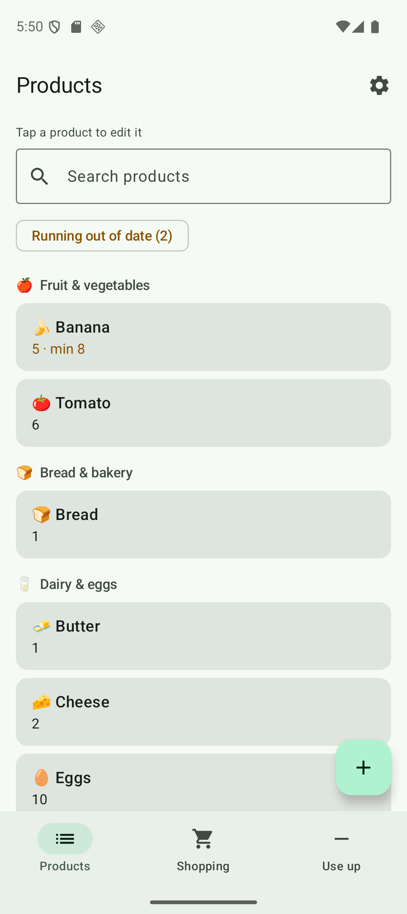
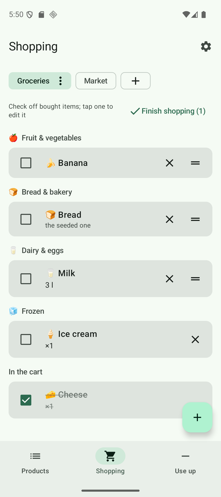
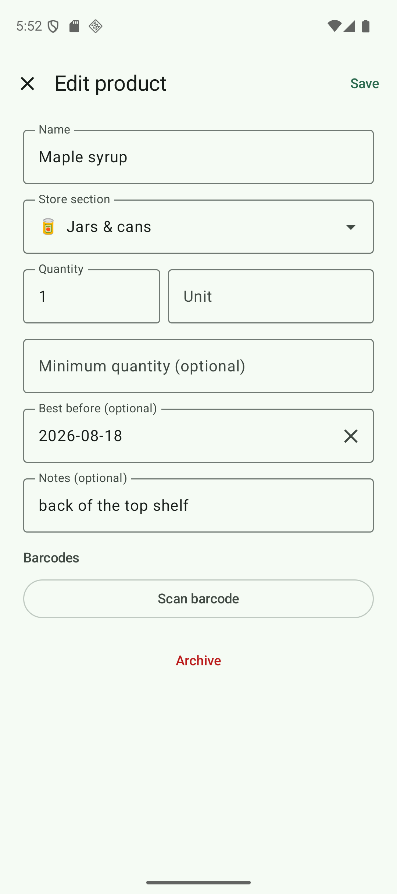

# Shelfie

An Android pantry app for your household: what you have at home, what you
need to buy, and what you are using up — kept in step between your phones.

Built for actual daily use rather than as a demo, so the awkward parts are the
point: it works offline first, it never asks anyone to make an account, and
"buying" a thing and "putting it in the pantry" are separate moments.

<p>
  
  
  
</p>

## What it does

- **Products** — the pantry: quantity, unit, an optional minimum, notes,
  barcodes, an optional best-before date, and a **store section** from a closed
  list of sixteen. The section is proposed from the name as you type and can be
  overridden; the emoji beside a name is separate from it, read from the name
  and never stored. Search by name; removing something archives it, and archived
  products come back when you plan them again. Truly deleting one is possible
  only when no list refers to it.
- **Best-before dates** — optional, picked from a calendar, never guessed. A
  chip on the Products tab appears when something is within a month of its date
  or already past it, and filters the pantry down to those. Meant for the jar at
  the back of the cupboard, not for the milk you see every day.
- **Shopping** — several named lists (one per shop), reorderable, with a virtual
  **Low stock** list of everything below its minimum that is not planned yet.
  A list walks the store section by section, in one fixed aisle order, so both
  phones read it the same way; checked-off items gather under their own heading
  at the bottom. Something bought once — birthday candles, an odd spice — can go
  on a list as a **one-off**, without becoming a product; it takes the aisle its
  name implies and leaves with the shop. Amounts are optional: an item can just
  say "we need this", and the amount is asked for when you check it off.
  Finishing a shop moves what you bought into the pantry in one step.
- **Use up** — tap a product to spend one, or scan its barcode. Dropping below
  the minimum offers to put it on a list, with undo.
- **Households** — one household is shared by every phone in it. Creating one hands
  you an invite code; entering that code on the other phone joins it. There is
  no sign-in: the app signs itself in anonymously the first time you create or
  join, and the code is the whole capability. Leaving is offered with or without
  deleting the household; either way the pantry stays on the device and simply
  stops syncing.

Interface strings ship in English and Polish, and the app declares both to the
system, so Android 13+ can be told to run this one app in the other language.

## How it is put together

Single-module Android app, Kotlin + Jetpack Compose (Material 3), MVVM with
manual dependency injection (`di/AppContainer.kt`) — no DI framework.

- **Room** is the source of truth. DAOs expose `Flow`s, repositories map
  entities to models, and the ViewModels combine those flows into one UI state.
  Schema changes are real migrations with exported schemas in `app/schemas` and
  a `MigrationTestHelper` test per step; the destructive fallback is gone.
- **Firestore** carries the sync. Push is a diff of the full-content Room flows,
  pull is a set of snapshot listeners, and conflicts resolve last-write-wins on
  `updatedAt`. Deletions are reported explicitly rather than inferred, because a
  missing row and a row that never arrived look the same from the other side.
  Clock skew between devices is measured against the server and corrected, so
  "last write" means last in server time.
- **Security rules** (`firestore.rules`) are the safety-critical artifact: a
  member may add or remove only their own membership, stamp only their own
  activity, and only to the server's clock. They have their own test suite.
- **Reading a name** is done by two local dictionaries sharing one crude Polish
  stemmer (`emoji/WordDictionary.kt`): one answers with a store section
  (proposed, overridable, stored and synced), the other with the decorative
  emoji (derived on every draw, never stored, so it cannot go stale). No
  network, no model.

## Building it

You need your own Firebase project; the one this app talks to is not in the
repo.

1. Create a Firebase project, add an Android app with the applicationId
   `io.github.rafalpawlisz.shelfie` (or change it in `app/build.gradle.kts`),
   and register your debug signing certificate's SHA-1.
2. Enable **Anonymous** sign-in under Authentication. Nothing else is needed —
   there are no other providers.
3. Create a Firestore database and publish `firestore.rules` to it.
4. Download `google-services.json` into `app/`. It is gitignored on purpose.
5. Build: `./gradlew :app:assembleDebug`

Android Studio, JDK 21, `minSdk 29`, `targetSdk 36`. Barcode scanning uses the
Play Services code scanner, so it needs Google Play services and a real camera —
an emulator will run everything else.

## Tests

```bash
./gradlew :app:testDebugUnitTest
```

JVM tests for the ViewModels, the sync engine, name sorting and the emoji
suggester, against hand-written fakes.

```bash
./gradlew :app:connectedDebugAndroidTest
```

Instrumented tests for what only SQLite can answer: migrations, foreign-key
cascades, the unique item slot, and the archived-product filter. **These
uninstall the app on every connected device**, wiping its data — pin one
emulator with `ANDROID_SERIAL=emulator-5554` (or unplug your phone) before
running them.

```bash
cd firestore-tests && npm ci && npm test
```

Security-rules tests, hosted by the Firestore emulator via
`firebase emulators:exec`. Needs Node 22 and `firebase-tools`.

All three suites run in CI on every push to `main`.

## Known limits

Deletions are pushed straight through rather than through a durable outbox, so a
process death between deleting something and the first sync session can lose the
deletion (the row is gone locally, the other phone keeps it). The push diff
cache is not seeded from pulled documents, which costs one redundant write per
pulled change. Neither hurts two phones in one household; both are written down
rather than pretended away.
